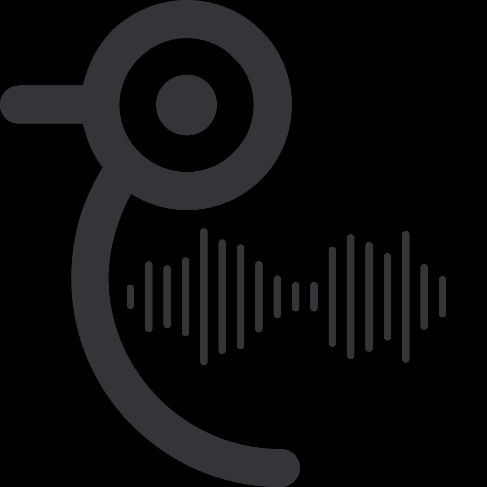

<table align="center"><tr>
  <td><h1>ChirpDrop</h1></td>
  <td></td>
</tr></table>

# What is ChirpDrop?

ChirpDrop turns any device with a speaker and microphone into a broadcast messenger. Type a message, hit Send, and your device plays a short audible "chirp" that encodes the text as sound. Any nearby device with ChirpDrop open and listening decodes the chirp through its microphone and displays the message instantly.

Because sound is a physical broadcast, one chirp reaches every listening device at once, which is something AirDrop and Bluetooth can't do. You can share a link with an entire lecture hall in two seconds, exchange contact info with no camera or QR code, or send a WiFi password across the room without either device ever touching a network.

# How it works

1. Encoding: Text is modulated into audio tones using multi-frequency FSK (frequency-shift keying), with Reed–Solomon error correction so noisy transmissions fail cleanly instead of producing garbled text.

2. Transmission: The waveform plays through the speaker via the Web Audio API. ChirpDrop automatically repeats each chirp three times for reliability.

3. Decoding: Listening devices capture the microphone audio, feed it to the decoder frame-by-frame, and verify the checksum before displaying anything. Duplicate transmissions from the auto-repeat are filtered out automatically.

# Features
- One-to-many broadcast: A single chirp can reach unlimited nearby listeners
- Auto-retry + deduplication: Sends a chrip 3 times, and receivers keep exactly one copy
- Live waveform visualization: You can watch the data leave (and arrive at) your device
- Smart links: Received URLs render as clickable links
- Mic privacy control: You can stop using the microphone at any time
- Dark mode
- Works everywhere: Any modern browser, phone or laptop works, no install required

# Tech stack

- React + Vite: UI and build tooling
- ggwave by Georgi Gerganov (MIT): The open-source data-over-sound library providing FSK modulation and Reed–Solomon error correction. ChirpDrop builds the product layer on top: the use case, UX, reliability features (auto-retry, dedupe), visualization, and mic controls.
- Web Audio API: Playback, microphone capture, and AnalyserNode-driven waveform rendering
- Netlify: Hosting (HTTPS required for microphone access)

# Running locally

`bashgit clone https://github.com/AbhishekS680/ChirpDrop.git`
`cd ChirpDrop`
`npm install`
`npm run dev`

Open http://localhost:5173. To test receiving, open the app in two windows. Listen in one, and send in the other. Make sure your volume is up.

Note: Microphone access requires a secure context (HTTPS or localhost), so cross-device testing works best against the deployed site.

# Limitations
- Because the bandwidth is around 8–16 bytes/sec, ChirpDrop can only send short text and links, not files.
- Very loud environemnts can cause the decoder to not get the correct audio

# Credits
Built solo by Abhishek Sinha. Acoustic modem powered by the open-source ggwave library.